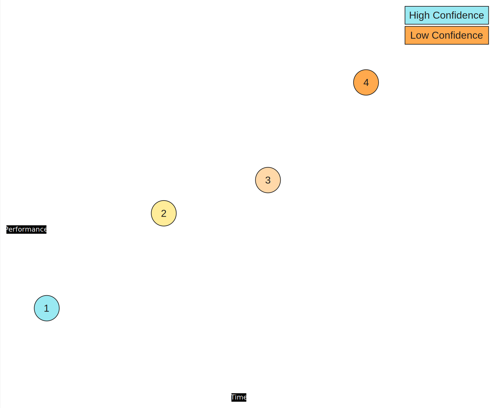
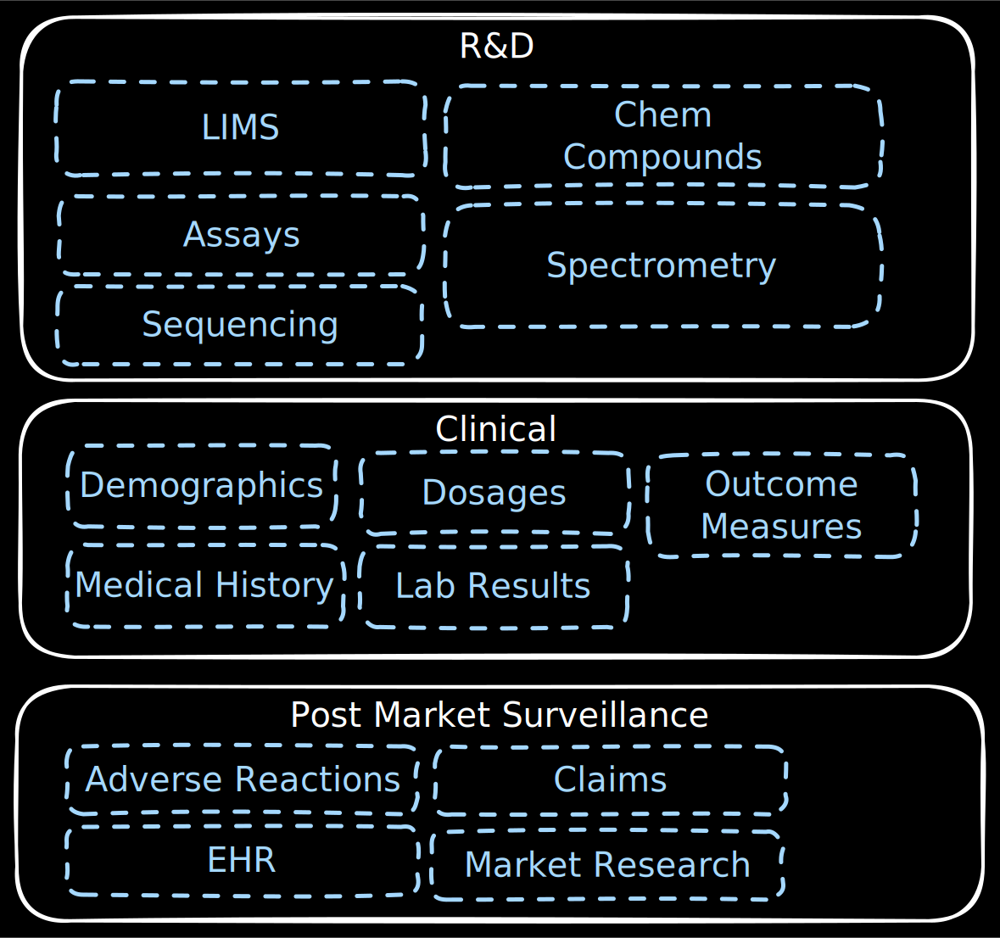
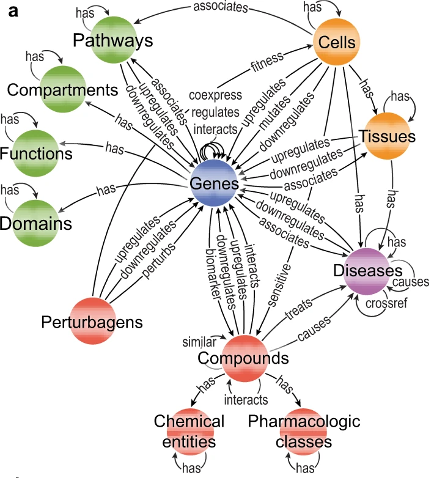
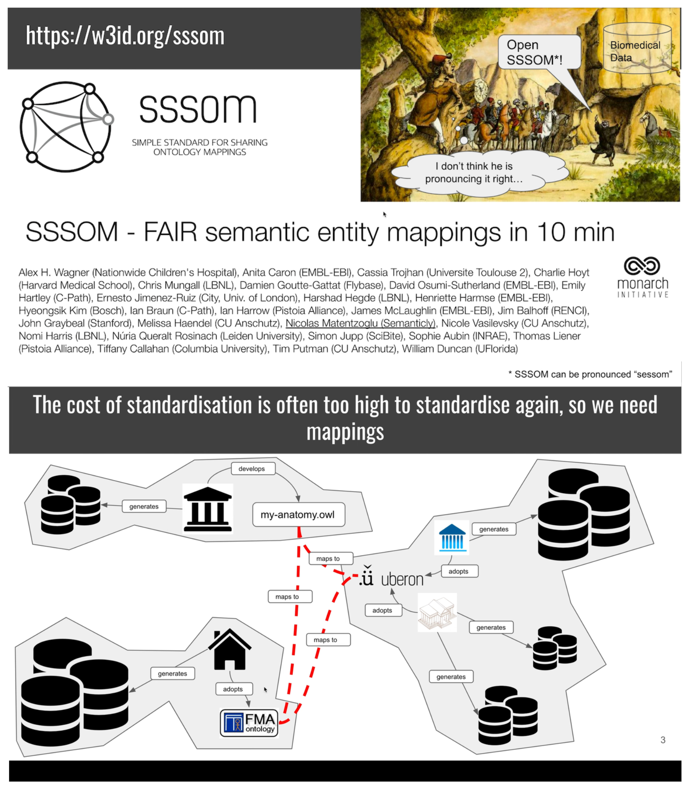
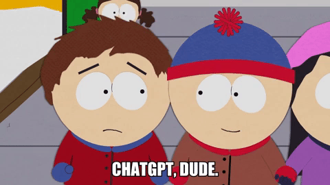
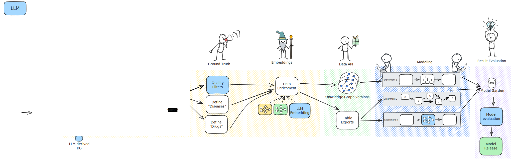
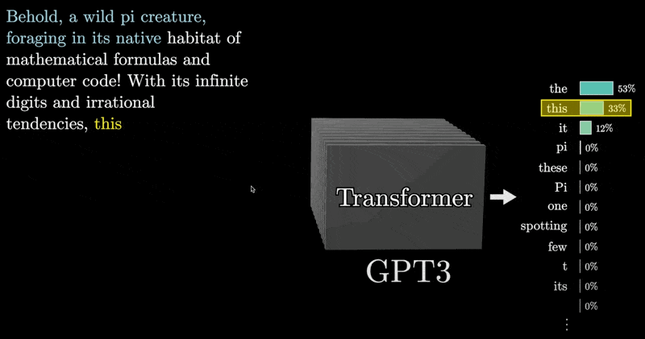
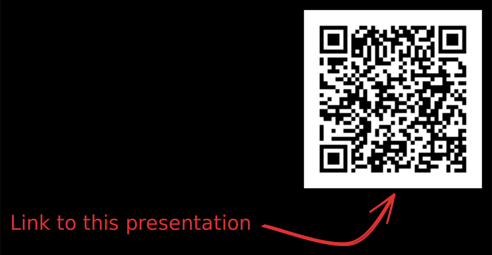

<!-- 
_class: 
- lead
-->

# Using Knowledge Graphs in Drug  Repurposing
## The Evolution from Traditional KGs to Foundation Models

[Pascal Brokmeier](https://www.linkedin.com/in/pascalwhoop/)

---

# Who is Pascal

#### Work

- Head of Engineering at **Every Cure**
- Previously Principal Data Engineer at **Quantum Black**
- And of course ... a **Data Minded** Engineer as well 😊

#### Education

- Studied in Information Systems at University of Cologne   ("Duales Studium")

#### Life

- Born in Germany
- Live in the Netherlands
- Always keen to meet new people, **do come say hi** later!

---

### Our plot for today

**First Act**: The First S Curve - Traditional Knowledge Graphs and Machine Learning for Drug Repurposing

**Second Act**: Transition - The Need for a Paradigm Shift

**Third Act**: Foundation Models stealing the show 

**Fourth Act**: The place of Knowledge Graphs in the Future

---

<!-- 
_class: lead
-->

## Act 1: The First S Curve
### Traditional Knowledge Graphs and Machine Learning for Drug Repurposing

---

<!-- paginate: true -->

## 1990+: Low Hanging Fruit are running out

Drug Discovery is becoming ever more difficult
- R&D costs soaring
- New drugs not keeping pace

Same time: Data availability explosion

- Electronic records
- growing body of scientific literature
- Genomics & Imaging data
- Wearables

What if we could use this data 🤔

---
## 1990 - 2010: Silos of Knowledge being built up

- Various domains building up their data domains
- Connectivity between them mostly missing
- Progress is made but unified view lacking

<!--
- Pharma companies are massively investing across their entire lifecycle
- Large amounts of data are generated
- However as with all large enterprises, data is siloed
- Pharma is particularly plagued by low collaboration due to sensitivity of data
 -->

---
<!-- 
_footer: Source: https://www.nature.com/articles/s41467-022-33026-0
 -->

## 2010s: Traditional Knowledge Graphs: Early Wins

- Knowledge Graphs (KGs) as specialized databases unifying data across domains
- Connect entities: diseases, genes, proteins, drugs
- Early examples:
  - [Hetionet](http://neo4j.het.io/browser/): Integration of multiple biomedical databases
  - [OpenBioLink](https://openbiolink.github.io/): Integration of multiple biomedical databases
  - [RTX](https://www.biorxiv.org/content/10.1101/765305v2.full.pdf): Integration of multiple biomedical databases

<!-- 
Open Hetionet and show 

 -->
---

## Arrival of Specialized Knowledge Graphs

- [SPOKE](https://spoke.ucsf.edu): Focusing on high curation quality
- [GARD](https://pubmed.ncbi.nlm.nih.gov/33183351/): Designed for rare diseases
- [RTX KG2](https://github.com/RTXteam/RTX-KG2): Prioritizing number of sources and data categories ingested
- [PRIME](https://github.com/mims-harvard/PrimeKG): Leveraging Embedding distances for clique merging
- ...

<!-- 

 -->

### There is a lot of work being done but somehow this still feels like a _breadth first search_

We are not really getting closer to actual patient impact

---

<!-- 
_class: lead
-->

## Act 2: The Transition
### KGs provide a great scaffold but their creation is still painfully manual

---
## Problem 1: Everyone copies from the same places

- KGs need to ingest existing data, often from the same sources
- However, how data is ingested differs greatly 
- So if more is not always better and ingest does not = ingest
- How about unifying standards?

---
 
## Problem 2: KGs are distinct so we need IDs

But IDs require someone to hand them out

- We originate from a siloed world
- each domain already had its own ID systems
- now also KGs have their own ontology systems

---
<!-- 
_footer: "Flux Dev Generated"
-->

---
<!-- _footer: Source: https://w3id.org/sssom -->

## Problem 3: KGs struggle encoding continous data

<section class="hbox">	

 
 
<ul>
<li>KGs excel at encoding relationships and networks</li>
<li>But a living organism is a messy continuous space</li>
<li>Not easy to encode without losing too much information</li>
</ul>

 

<iframe width="560" height="315" src="https://www.youtube.com/embed/7Hk9jct2ozY?si=-409KuU0YpHsaTEO&amp;start=112" title="YouTube video player" frameborder="0" allow="accelerometer; autoplay; clipboard-write; encrypted-media; gyroscope; picture-in-picture; web-share" referrerpolicy="strict-origin-when-cross-origin" allowfullscreen></iframe>

 

 
</section> 

---

<!-- 
_class: lead
-->

## Act 3: The Rise of Foundation Models
### Because really all we need is...

---

---

## Language models are being proposed at every step of the process

---

## Initial successes leveraging LLMs but the KG representation of information remains

- Merging equivalent nodes: PRIME KG uses BERT based cosine similarity to merge nodes
- Verifying drug-disease predictions: LLMs have helped verify predictions by collecting evidence from text
- Generate new KGs: LLMs have been used to extract triples from scientific literature
- [GNN for drug-disease predictions](http://txgnn.org/)

However, we are still using the KG as an intermediate information representation

---

## (Raw Take): Maybe _Attention is all you need_? Transformers may just directly generate the prioritized drug list for each disease

---
## Independent of the approach, scalability, bias, explainability and verifiability remain hard problems

- Scalability issues with growing biomedical data when KG representation remains
- Data bias affecting predictions
- Lack of explainability ("black box" problem)
- Limited integration of real-world data

Most of all: **Generating predictions is easy, verifying if they are correct is hard**

---

## Conclusions: 

1. KGs broke the silos. Good!
2. But we are hitting their limitations: Manual curation, thinking in IDs, missing continuous data
3. Foundation Models might be a total replacement, rather than just a Turbo Charger we tack onto it
4. But unless you solve the verification problem all you have is a black box 

---

# Some useful links

- [TXGNN](http://txgnn.org/)
- [Monarch initiative, doing the integation heavy lifting](https://monarchinitiative.org)
- [Open Evidence, medical RAG, done well](https://www.openevidence.com)
- [Biolink Model defining a KG language](https://biolink.github.io/biolink-model/)
- [OpenTargets, mapping drug targets to diseases](https://www.opentargets.org/)

Last but not least: Keep an eye out for our [GitHub organisation](https://github.com/everycure-org), we will open source our work soon

---

<!-- 
_class: lead
-->

## Thank You!

Questions?

